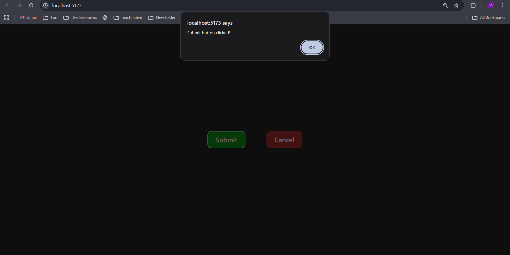

# First Flight 🚀

A mini React project built with [Vite](https://vitejs.dev/).    

## Features
- ⚡ Lightweight setup with Vite  
- 🎨 Customizable button modes (`primary`, `secondary`)  
- 🧩 Component-driven structure inside `components/`  
- 📝 Clean Git commit history (daily tasks logged)  

## Project Structure
first_flight/
┣ components/ # Reusable React components
┣ public/ # Static assets
┣ src/ # App entry & logic
┣ .gitignore # Ignore unnecessary files
┣ README.md # Documentation
┗ package.json

## Day 1 Deliverables
- Project initialized with Vite
- Repo created and pushed to Github
- First component: `<Button />` with `label`, `onClick`, `mode`, props
- Two buttons rendered in `App.jsx`
- 

commit message: `Day 1: Setup + Button component`